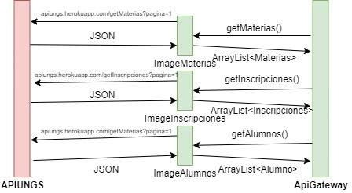
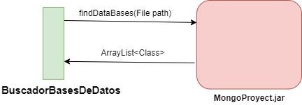
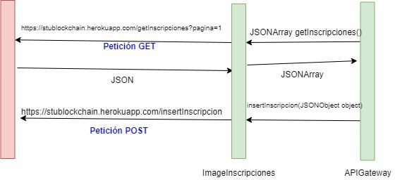
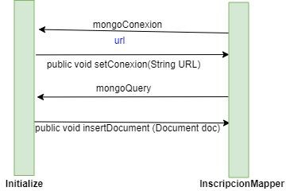
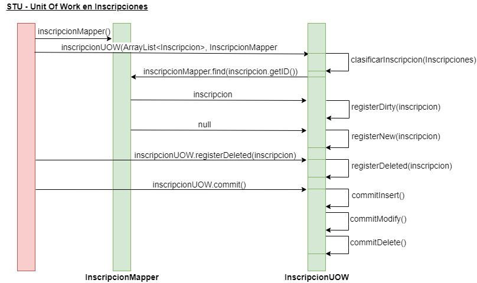
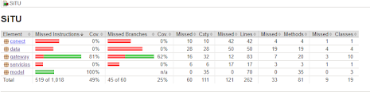

# Proyecto Profesional 2

# **Proyecto:**	Sistema	de	Transacciones Universitario

## Profesores:

- Lautaro Tacchini: <ltacchini@campus.ungs.edu.ar> 
- Javier Martínez-Viademonte: <javiermv@ungs.edu.ar> 
- Matías Raia: <mhraia@yahoo.com.ar>

## Alumnos:

- Leonardo Cantarini: <leonardocantarini@gmail.com>
- Galileo Luna: <galileoungs@gmail.com>

- Repo:<https://gitlab.com/galileoluna/STU/-/tree/revert-28579f61> 
- API: <https://gitlab.com/galileoluna/apiUNGS> 
- Cubrimiento:[https://galileoluna.gitlab.io/STU/code-cover](https://galileoluna.gitlab.io/STU/code-coverage-reports/)[age-reports/](https://galileoluna.gitlab.io/STU/code-coverage-reports/) 
- MongoProyect:[https://gitlab.com/leonardocantarini/mong](https://gitlab.com/leonardocantarini/mongoproyect) [oproyect](https://gitlab.com/leonardocantarini/mongoproyect)

- Blockchain: <https://gitlab.com/galileoluna/stublockchain> 
- BlockchainProyect: <https://gitlab.com/galileoluna/blockchainproyect>

## **Introducción**

El sistema Guaraní es el sistema de registro de las actividades de la gestión académica dentro de la universidad desde que un alumno se inscribe hasta que egresa. Este sistema está persistido en una base de datos relacional llamada PostgreSQL, que tiene el inconveniente de no ser lo suficientemente transparente, ya que este tipo de base de datos puede ser modificado por alguien con permisos especiales sin generar algún tipo de aviso.

Para eso leeremos el sistema SIU Guaraní y, con el fin de darle mayor integridad y seguridad a las transacciones realizadas, las guardaremos en una cadena de bloques. Esto es una estructura de datos cuya información se agrupa en bloques, gracias a técnicas criptográficas. La información contenida en un bloque solo puede ser rechazada o editada modificando todos los bloques posteriores. Esto nos da la integridad y la seguridad que necesitamos para tener un sistema altamente confiable.

Con el fin de resolver este problema persistiremos todas estas transacciones en varias bases de datos- De este modo, preservamos los datos y también mantendremos sincronización entre los datos del sistema Guaraní y el STU.

Para nuestra segunda iteración, nosotros reemplazamos el lectorAPI por un APIGateway, para tener un código más limpio y legible, luego implementamos stublockchain, que es un proyecto que lee una api, **stublockchain** ,en la cual simula ser una red blockchain, luego nosotros hicimos foco en mantener la consistencia de las múltiples bases de datos con la api de la facultad.

## **Diseño**

Nuestro diseño consiste en la persistencia de los datos de la API de la universidad, para luego persistir los objetos en memoria, parsear el json a sus respectivos objetos, y luego persistida, y sincronizada con las múltiples bases de datos.

Consumiendo api

Consumiendo apiEl programa empieza, con la clase APIGateway, que posee tres funciones, encargadas de la lectura de la API del sistema universitario, **apiungs**, cada una de estas tres funciones serán las encargadas de tomar todos los datos actualizados de la facultad en tiempo real.

Luego, al persistir el modelo, contaremos con subproyectos que nos brindaran abstracción a la hora del manejo de las bases de datos. Para poder encontrarlo, utilizaremos la técnica de inyección de dependencias, en la cual tendremos la clase BuscadorBasesDeDatos, que tiene la función FindDataBases(),que nosotros le pasaremos el path que apunte hacia un archivo .jar Esta función es la encargada de encontrar las clases necesarias para el manejo de las bases de datos.Nos retorna una Lista con las clases del proyecto que nosotros le pasamos, por ejemplo cuando le pasamos mongoProyect, nos retorna conexionMongo y consultaMongo.

Luego el MongoProyect, es el encargado de la implementación de la base de datos,ya que esta realiza la conexion, como también , abstrae todo lo que tiene que ver con la conexión a la base de datos. MongoProyect posee dos clases que son las encargadas de la conexión, llamadas **conexiónMongo** y **consultaMongo.** Esta última será la encargada de procesar las querys, e interactuar directamente con la base de datos.

Por otro lado tenemos otro proyecto **STUBlockchain,** o BlockchainProyect, que su función es consumir la api que simula ser una red Blockchain,stublockchain,esta realiza un algoritmo de proofOfWork, que nos garantiza la integridad de los bloques. El blockchainProyect, tiene implementado un api gateway, con el cual nos comunicaremos con nuestra api, aca tendremos una clase ImageInscripcion que nos abstrae de la lectura e insertar datos en stublockchain, en APIGateway ,poseemos dos funciones, que son getInscripciones() y insertInscripcion().

A la hora de realizar el DataMapper nosotros poseemos la clase **Initialize** en el cual nosotros,poseemos tres funciones que son las encargadas de devuelven los métodos, este
proceso lo realizamos gracias a class.ForName, de las clases de nuestros proyectos, por  un lado tenemos dos funciones que su función es darnos los métodos para inicializar la base de datos mongo y por otro lado tenemos otra función que nos devuelve las querys que podemos realizar a la base de datos, por otro lado tenemos la función getRequest() que  nos devuelve las request del proyecto stublockchain.

Para el manejo adecuado de las transacciones de persistencia tenemos una implementación del patrón Unit Of Work, cuya función es la de mantener actualizados los registros en las bases de datos y mantener un conjunto de operaciones que serán realizadas como una transacción a la base de datos. Esta funcionalidad está representada en la clase **InscripcionesUOW**, la cual recibe por parámetros una lista de inscripciones con sus operaciones necesarias (INSERT, MODIFY, DELETE) que se carga como propiedad "context". Mediante los métodos registerNew(), registerModify() y registerDelete(), se pueden agregar inscripciones con sus respectivas operaciones en el listado context. Luego, una vez que se desea persistir como una transacción, se utiliza el metodo commit(), que implementa los metodos commitNew(), commitModify() y commitDelete() para las operaciones de insert, update y delete en las bases de datos.

Y al final nosotros para mantener la consistencia entre la api , y las múltiples bases de datos, nosotros vamos a tener el DataMapper, donde están todas las operaciones con todas las bases de datos disponibles, por lo que en cada una de estas operaciones tendremos que llamar mediante class.forName(), a los métodos de nuestros subproyectos, luego de ser invocados, nosotros le pasaremos, los métodos que generamos en initialize, y podemos.

## **User Stories**

|**User Story 1**: Quiero guardar los datos de las inscripciones a materias universitarias con sistemas de almacenamiento distintos.|
| :- |
|
**Criterios de Aceptación**

1.

a. Inscripción completada

b. Materia “m” no existente

c. Materia “m” no disponible en fecha “f”

d. Alumno “a” no existente

2. Encontrar bases de datos

&emsp;a. Encuentra base de datos mongodb, se encuentran clases Main

,ConexionMongo y ConsultaMongo

3. Lectura de API

&emsp;a. testGetInscripciones()
|
|
Datos de prueba:

Test1: testGetMongo():”**/services/mongo/mongoproyect.jar**” testGetInscripciones():

b.  Datos	de	prueba:	JSON [{"id":"5f6d1a5beeb9a140e1b5e2e8","nombre":"PP2","codigo":"A102"

},{"id":"5f6d1a6feeb9a140e1b5e2e9","nombre":"PP1","codigo":"A101"

}]
|

|**User Story 2:**Quiero contar con una implementación de blockchain.|
| :- |
|
**Criterios de Aceptación**

1.**TestGetBlockchain():** generamos el bloque génesis.
|
|
**Datos de prueba:** Nos retorna

**ID**: "000000000000000000000000",

**alumno**: "bloque genesis", **legajo**: "bloque genesis", **materia**: "bloque genesis", **codigo**: "bloque genesis",

**fecha**: "2020-12-08T00:00:00Z",

**hashAnterior**:

"CC50DF82BCF43A7F75AE2169BD255F125D8C36FE6FE420852B4E E9BFB0D34286",

**hashActual**:

"970EC274CA867815174EBE4EFF19282000F9495A6C7254E94991D1FB4DC3DF30
|

|**User Story 3:** Quiero mantener sincronizado las bases de datos, manteniendo la consistencia entre cada una de ellas.|
| :- |
|
**Criterios de Aceptación:**

1. testRegisterNew()

2. testRegisterDirty()

3. testRegisterDelete()

4. testCommit()
|
|
**Datos de prueba**:

private	final	Inscripcion	inscripcion1=	new Inscripcion("5f6d2c43a91109d21ca3fef7","galileo","12345678","PP1","A101","2020

-09-24T00:00:00Z");

private	final	Inscripcion	inscripcion2=	new Inscripcion("5f6d2c43a91109d21ca3fef7","galileo","12345678","PP1","A101","2020

-09-24T00:00:00Z");

private	final	Inscripcion	inscripcion3=	new Inscripcion("5f6d2c43a91109d21ca3fef7","lautaro","12345678","PP1","A101","202 0-09-24T00:00:00Z");
|

## **Cobertura**

